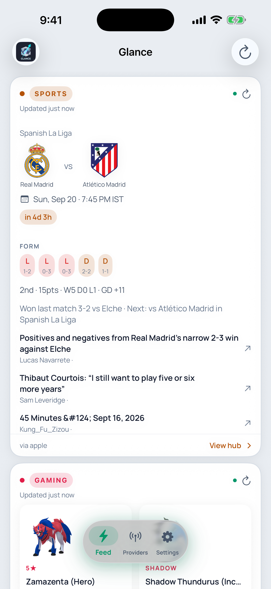

# Glance

A personal intelligence dashboard for iOS. Aggregates multiple data streams into a single home screen with a clean, dark-mode-first design.



## Features

- **Pulse Feed** — Unified card-based view of all your data streams
- **Real Madrid** — Match fixtures, live timeline, and news via ManagingMadrid + TheSportsDB
- **Pokémon GO** — Current raids, events, and priority recommendations
- **GitHub Trending** — Daily trending repositories with language breakdown
- **AI Intel** — Curated AI/ML news summarized by on-device or cloud intelligence
- **Custom RSS** — Add any RSS feed and surface it as a card in your Pulse

## Architecture

```
Glance/
├── App/              # App entry, AppState, ContentView, floating dock
├── Core/
│   ├── Cache/        # CacheStore (UserDefaults), KeychainStore for secrets
│   ├── Intelligence/ # IntelligenceRouter — Apple Foundation Models → Gemini fallback
│   ├── Network/      # API clients (Exa, Gemini, GitHub, SportsDB, RSS, etc.)
│   └── Time/         # Time formatting utilities
├── DesignSystem/     # Theme, colors, fonts (Manrope), reusable components
├── Features/
│   ├── AiIntel/      # AI news pipeline and views
│   ├── CustomRSS/    # User-added RSS feeds
│   ├── GenericRSS/   # RSS parsing pipeline
│   ├── GitHub/       # Trending repos pipeline and views
│   ├── Madrid/       # Real Madrid fixtures, timeline, articles
│   ├── PoGo/         # Pokémon GO raids and events
│   └── Pulse/        # Main feed view and card rendering
├── Settings/         # Settings, API key management, sources, RSS feed config
└── Shared/           # Enums, extensions
```

## API Keys

Glance requires the following API keys, configured in Settings:

| Key | Purpose | Source |
|-----|---------|--------|
| **Exa** | Web search for AI Intel articles | [exa.ai](https://exa.ai) |
| **Gemini** | LLM intelligence routing (fallback when Apple Intelligence unavailable) | [aistudio.google.com](https://aistudio.google.com) |

Real Madrid and Pokémon GO data use free APIs (TheSportsDB, public RSS feeds) — no keys required.

**Gemini Model Selection:** Choose between Flash 3.6, 3.7, or 3.8 in Settings.

## Requirements

- iOS 17.0+
- Xcode 15.0+
- Swift 5.9+

## Download

Grab the latest `.ipa` from [Releases](https://github.com/atifkhan161/glance/releases/latest).

## Installing via AltStore

Glance can be sideloaded onto your iPhone using [AltStore](https://altstore.io).

### Prerequisites

1. Download and install [AltServer](https://altstore.io) on your Mac
2. Connect your iPhone via USB and trust the computer
3. Install AltStore on your device from the AltServer menu bar icon

### Sideload the IPA

1. Download `Glance.ipa` from the [latest release](https://github.com/atifkhan161/glance/releases/latest)
2. **Option + click** the AltServer menu bar icon and select **Sideload .ipa...**
3. Choose the downloaded `Glance.ipa` and enter your Apple ID when prompted
4. On your iPhone, go to **Settings > General > VPN & Device Management** and trust your Apple ID under "Developer App"

> **Note:** Free developer accounts require re-signing every 7 days. AltStore refreshes apps automatically when your device is on the same WiFi as AltServer.

## Getting Started (from source)

1. Clone the repository:
   ```bash
   git clone https://github.com/atifkhan161/glance.git
   ```

2. Open `Glance/Glance.xcodeproj` in Xcode

3. Build and run on a device or simulator

4. Open Settings in-app and enter your API keys

## Design

- **Dark mode first** with light mode support
- **Floating pill dock** navigation (custom, not UITabBar)
- **Manrope** typeface throughout
- **Card-based** layout with accent color coding per data source
- Respects `UIAccessibility.isReduceMotionEnabled`

## License

MIT
