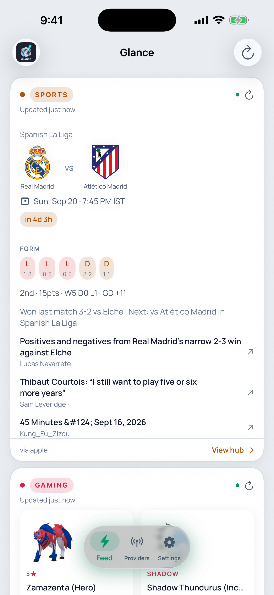

# Glance

A personal intelligence dashboard for iOS. Aggregates multiple data streams into a single home screen with a clean, dark-mode-first design.



## Features

- **Pulse Feed** — Unified card-based view of all your data streams
- **Real Madrid** — Match fixtures, live timeline, and news via ManagingMadrid + TheSportsDB
- **Pokémon GO** — Current raids, events, and priority recommendations
- **GitHub Trending** — Daily trending repositories with language breakdown
- **AI Intel** — Curated AI/ML news summarized by on-device or cloud intelligence
- **Custom RSS** — Add any RSS feed and surface it as a card in your Pulse

## Architecture

```
Glance/
├── App/              # App entry, AppState, ContentView, floating dock
├── Core/
│   ├── Cache/        # CacheStore (UserDefaults), KeychainStore for secrets
│   ├── Intelligence/ # IntelligenceRouter — Apple Foundation Models → Gemini fallback
│   ├── Network/      # API clients (Exa, Gemini, GitHub, SportsDB, RSS, etc.)
│   └── Time/         # Time formatting utilities
├── DesignSystem/     # Theme, colors, fonts (Manrope), reusable components
├── Features/
│   ├── AiIntel/      # AI news pipeline and views
│   ├── CustomRSS/    # User-added RSS feeds
│   ├── GenericRSS/   # RSS parsing pipeline
│   ├── GitHub/       # Trending repos pipeline and views
│   ├── Madrid/       # Real Madrid fixtures, timeline, articles
│   ├── PoGo/         # Pokémon GO raids and events
│   └── Pulse/        # Main feed view and card rendering
├── Settings/         # Settings, API key management, sources, RSS feed config
└── Shared/           # Enums, extensions
```

## Apple Intelligence

Glance runs AI entirely on-device using Apple's Foundation Models framework — zero cost, zero latency, fully private. No data leaves your phone.

### AI Features

| Feature | What it does |
|---------|-------------|
| **Article Summaries** | Streaming numbered sections + verdict on any article |
| **Real Madrid** | Match form, La Liga standing, tactical intel from web search |
| **Pokémon GO** | Top priority raid/event recommendation |
| **AI Intel** | Classifies news as Frontier Labs vs Open Weights |

### How It Works

1. **On-device** — Uses `SystemLanguageModel` with permissive guardrails for content summarization
2. **Fallback** — If Apple Intelligence is unavailable, routes to Gemini cloud (API key in Settings)
3. **Graceful degradation** — If both fail, feature hides silently — no crashes, no empty cards

### Requirements

- iPhone 15 Pro / iPhone 16 / iPhone 17 (A17 Pro or later)
- iOS 18+ with Apple Intelligence enabled
- ~1.6 GB model download (auto-downloads on first use)

Check status in **Settings > Sources > ON-DEVICE AI**.

## API Keys

Glance requires the following API keys, configured in Settings:

| Key | Purpose | Source |
|-----|---------|--------|
| **Exa** | Web search for AI Intel articles | [exa.ai](https://exa.ai) |
| **Gemini** | LLM intelligence routing (fallback when Apple Intelligence unavailable) | [aistudio.google.com](https://aistudio.google.com) |

Real Madrid and Pokémon GO data use free APIs (TheSportsDB, public RSS feeds) — no keys required.

**Gemini Model Selection:** Choose between Flash 3.6, 3.7, or 3.8 in Settings.

## Requirements

- **iOS 26.0+** on device (the app's deployment target)
- Xcode 16.0+ and Swift 5.9+ to build from source
- An iPhone 15 Pro Max or newer is recommended, but any arm64 device on iOS 26.0+ works

## Download

Grab the latest `.ipa` from [Releases](https://github.com/atifkhan161/glance/releases/latest).

The published IPA is **ad-hoc signed but not certificate-signed**. That is deliberate — every method below
re-signs it with your own Apple ID, so shipping a real signature would only be discarded. It does need a
signature to be present, though: sideloaders re-sign from an already-signed input, and a completely
unsigned app fails with a bundle-ID mismatch. It carries **no entitlements** — Glance has no app
extensions, no app groups, and uses the default keychain, so the sideloader supplies everything needed. Choose the method that fits you:

| Method | Computer needed | Best for |
| --- | --- | --- |
| [LiveContainer](#livecontainer) | Once, to install LiveContainer | Most people — no weekly chore, unlimited apps |
| [SideStore](#sidestore) | Once, to pair | Background refresh, no laptop needed afterwards |
| [AltStore](#altstore) | Every refresh | Simplest to set up, most upkeep |

### LiveContainer

[LiveContainer](https://livecontainer.github.io) is an app launcher that runs other apps inside itself.
One signed app slot can hold many, which sidesteps the free-tier 3-app limit entirely.

1. Install LiveContainer using its [official guide](https://livecontainer.github.io/docs/installation).
   It can be installed via Impactor, iloader, or an existing SideStore. (LiveContainer's docs
   specifically do **not** support Sideloadly, i4/3u Tools, or most online signers.)
2. Import your signing certificate so LiveContainer can sign apps in JIT-less mode:
   open LiveContainer **Settings → Import Certificate from SideStore**. SideStore opens, exports a
   certificate, and LiveContainer picks it up.
3. Check **Settings → JIT-Less Mode Diagnose → Test JIT-Less Mode**. It should report
   `JIT-Less Mode Test Passed`. If it reports a missing certificate, re-export from SideStore —
   the certificate changes on every refresh, so an outdated one breaks app signing.
4. Tap the **+** button in the top-right of LiveContainer and select the downloaded `Glance.ipa`.
5. Launch Glance from the LiveContainer list.

**Re-export the certificate after every SideStore/AltStore refresh** — this is the most common cause
of a suddenly-failing install. A calendar reminder every 7 days is a good idea on a free account.

### SideStore

[SideStore](https://sidestore.io) is a fork of AltStore that refreshes on-device over a local VPN, so
no computer needs to stay awake on your network.

1. Follow the [SideStore installation guide](https://sidestore.io) to pair once with a PC/Mac.
2. Open SideStore → **My Apps** → **+** and pick the downloaded `Glance.ipa`.
3. On first launch, go to **Settings → General → VPN & Device Management** and trust your Apple ID
   under "Developer App".
4. Keep the LocalDevVPN connected so SideStore can refresh in the background.

### AltStore

[AltStore](https://altstore.io) refreshes over WiFi from a computer running AltServer, so that
computer must be awake and on the same network when your certificate expires.

1. Download and install [AltServer](https://altstore.io) on your Mac (macOS 11+).
2. Connect your iPhone via USB, trust the computer, then install AltStore on the device from the
   AltServer menu bar icon.
3. Save the `Glance.ipa` to the Files app (e.g. **Files → On My iPhone → Downloads**).
4. Open AltStore → **My Apps** → **+** in the top-left, select the IPA, and wait while AltServer
   signs and installs it.
5. Go to **Settings → General → VPN & Device Management** and trust your Apple ID.
6. If AltStore prompts that it wants to open Glance, accept it.

**Option:** hold **Option** while clicking the AltServer menu bar icon and choose **Sideload .ipa…**
to install directly without AltStore. This skips the My Apps interface, but you must reinstall every
7 days by hand. Installing AltStore Classic is the better choice if you want managed refreshes.

### What to expect with a free Apple ID

- **7-day signature.** After it lapses the icon stays on your home screen but tapping it does nothing
  until you refresh. LiveContainer works around the *app count* but not this clock.
- **3 apps at once**, and AltStore/SideStore themselves count against that.
- **No push notifications** for apps running inside LiveContainer.
- **~10 new App IDs per rolling 7 days.** Glance ships without extensions, so it consumes one.

Developer Mode must be enabled the first time you open a sideloaded app:
**Settings → Privacy & Security → Developer Mode**.

### Troubleshooting

| Symptom | Fix |
| --- | --- |
| **"bundleid does not match with the specified"** | The IPA had no code signature. Sideloaders re-sign the app, but they re-sign from an already-signed input, so a blank app fails bundle-ID validation. Download the current release. |
| **"The keychain access group '$(AppIdentifierPrefix)…' does not contain a Team ID prefix"** | Same class of problem — the IPA shipped with unexpanded Xcode entitlement placeholders. Current releases are signed with **no entitlements**; Glance needs none (no extensions, no app groups, default keychain). |
| Icon present but app does nothing | Signature expired — refresh from AltStore/SideStore, or re-import the certificate into LiveContainer |
| LiveContainer says "Certificate not found" | Certificate wasn't exported after a refresh. In SideStore: **Settings → Export Signing Certificate…**, save with a password, then **Import Certificate** in LiveContainer |
| "Application failed preflight checks" | Another sideload operation is mid-flight. Wait for it to finish and retry |
| Installation stalls "Processing" | First-time device registration with Apple can take up to a day. It only happens once |
| App installs but features are missing | LiveContainer does not apply the guest app's entitlements, and app permissions are applied globally. Anything depending on a private entitlement may not work |

> **Apple Intelligence:** Glance prefers on-device Foundation Models for summarization, falling back to
> the Gemini API. Under LiveContainer, Foundation Models requires JIT and is unavailable below iOS 26, so
> the app falls back to Gemini — or degrades gracefully with no AI summary if no key is set. See
> [Apple Intelligence limitations](docs/apple-intelligence-limitations.md).

## Getting Started (from source)

1. Clone the repository:
   ```bash
   git clone https://github.com/atifkhan161/glance.git
   ```

2. Open `Glance/Glance.xcodeproj` in Xcode

3. Build and run on a device or simulator

4. Open Settings in-app and enter your API keys

## Building the IPA

```bash
brew install zsign          # one-time
scripts/build-ipa.sh        # -> Glance/build/ipa/Glance-v<version>-unsigned.ipa
```

The script builds Release for `generic/platform=iOS`, ad-hoc signs with **zsign**, and packages the IPA.
It prints the bundle id, version, arch, SHA-256 and signature at the end, and verifies the signature both
before and after zipping. It fails the build rather than shipping a broken IPA.

## Releasing

```bash
scripts/release.sh patch       # 1.2   -> 1.2.1
scripts/release.sh minor       # 1.2.1 -> 1.3.0
scripts/release.sh 2.0.0      # explicit version
```

One command bumps `Info.plist`, builds and signs the IPA, tags, publishes the release, regenerates
`apps.json`, and then downloads the published asset back to confirm it matches the local build. Each
version gets its own tag and a `Glance-<version>.ipa` asset, so a version's download URL can never
change after the fact. The script refuses no-op and backwards bumps.

### Auto-updates in SideStore

`apps.json` at the repo root is a [SideStore source](https://sidestore.io/sidestore-source-types/).
Add it in SideStore under **Sources → + → Add Custom Source**:

```
https://raw.githubusercontent.com/atifkhan161/glance/main/apps.json
```

Glance then appears in Browse and offers updates in place when the source changes. Note that
`version` in `apps.json` must match `CFBundleShortVersionString` exactly or updates never appear —
which is why `release.sh` generates the file from the built IPA rather than maintaining it by hand.

### Why ad-hoc signing, and why zsign

The IPA is **not** signed with an Apple certificate. That is deliberate: every install method above
re-signs the app with the user's own Apple ID, so a real signature would only be discarded. But three
things still have to be right, and each one produced a distinct install failure:

| Requirement | Get it wrong and you see |
| --- | --- |
| A code signature must be **present** | `bundleid does not match with the specified` |
| Sign with **no entitlements** | `The keychain access group '$(AppIdentifierPrefix)…' does not contain a Team ID prefix` |
| **Reallocate CodeSignature space** | SideStore's ldid `_assert()` failure, or `the app is in an invalid format` |

**Do not hand-write `application-identifier` or `keychain-access-groups`.** Those values normally
contain Xcode build-setting placeholders like `$(AppIdentifierPrefix)`, and `codesign` does **not**
expand them — they get embedded literally and iOS rejects the install. Glance needs no entitlements of
its own: no app extensions, no app groups, and `KeychainStore` uses the default keychain (no
`kSecAttrAccessGroup`), so the default access group is already correct. Sign with none.

**Use zsign, not `codesign`.** zsign reallocates the embedded CodeSignature space before signing;
`codesign` leaves it too small (`zsign` reported growing it from 16368 to 64524 bytes). Insufficient space
is what makes SideStore's ldid path assert and fail. zsign also emits a SHA-256-primary CodeDirectory,
which is what iOS 16–26 accept. It is the same signer SideStore, LiveContainer and Feather use.

**Clear `.zsign_cache` before signing.** zsign caches per-file signature data in the working directory,
and a stale entry makes it emit `Info.plist=not bound` — the plist hash is simply omitted from the
CodeDirectory, so the bundle fails verification with `invalid Info.plist`. It only shows up when the
build changes what the plist contains, i.e. **exactly when you bump the version**, so it reads as an
intermittent release failure. `build-ipa.sh` clears the cache and signs with `zsign -f` to avoid it.

### Before publishing

Re-verify the packaged artifact, not just the `.app` — recompression must not disturb the signature:

```bash
cd /tmp && rm -rf vcheck && mkdir vcheck && cd vcheck
unzip -q ~/path/to/Glance-v1.2-unsigned.ipa -d x
codesign --verify --deep --strict x/Payload/Glance.app   # must print nothing
codesign -d --entitlements - --xml x/Payload/Glance.app 2>/dev/null | plutil -p -  || echo "entitlements: none"
codesign -dv x/Payload/Glance.app 2>&1 | grep -E "Identifier|CodeDirectory"
```

After uploading, download the asset back from GitHub and check the SHA-256 matches. A silent upload
failure once left a broken build published — the hash check is what caught it.

Two other things worth knowing:

- A stale `armv7` entry in `UIRequiredDeviceCapabilities` makes iOS reject the install. The build script
  strips it, but it is still present in `Glance/Resources/Info.plist`.
- Add a new `PRODUCT_BUNDLE_IDENTIFIER` at version bumps, or App Store Connect will reject the build.
- The IPA is unsigned, so **it is not verified on physical hardware** by the build. Check the release
  notes for whether an install was actually confirmed.

## Design

- **Dark mode first** with light mode support
- **Floating pill dock** navigation (custom, not UITabBar)
- **Manrope** typeface throughout
- **Card-based** layout with accent color coding per data source
- Respects `UIAccessibility.isReduceMotionEnabled`

## License

MIT
